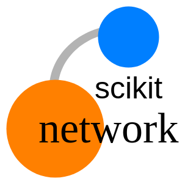

==============
scikit-network
==============

.. image:: https://img.shields.io/pypi/v/scikit-network.svg
        :target: https://pypi.python.org/pypi/scikit-network

.. image:: https://travis-ci.org/sknetwork-team/scikit-network.svg
        :target: https://travis-ci.org/sknetwork-team/scikit-network

.. image:: https://readthedocs.org/projects/scikit-network/badge/?version=latest
        :target: https://scikit-network.readthedocs.io/en/latest/?badge=latest
        :alt: Documentation Status

.. image:: https://pyup.io/repos/github/sknetwork-team/scikit-network/shield.svg
        :target: https://pyup.io/repos/github/sknetwork-team/scikit-network/
        :alt: Updates

Graph algorithms

* Free software: BSD license
* Documentation: https://scikit-network.readthedocs.io.

How to use scikit-network?
--------------------------

Graphs have a unified format, namely ``scipy.sparse.csr_matrix``.

About the documentation
-----------------------

We use the following notations in the documentation:

* :math:`A` denotes the adjacency matrix for undirected and directed graphs.

* :math:`B` denotes the biadjacency matrix for bipartite graphs (possibly non-square).

* :math:`d = A1` or :math:`B1` is the out-degree vector and :math:`D = \text{diag}(d)` the associated diagonal matrix.

* :math:`f = A^T1` or :math:`B^T1` is the in-degree vector and :math:`F = \text{diag}(f)` the associated diagonal matrix.

* :math:`w = 1^TA1` or :math:`1 ^TB1` is the total weight of the graph.

